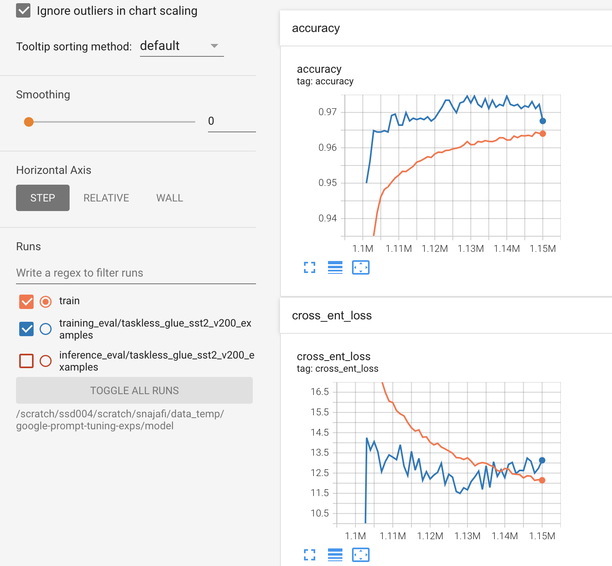

# Binary Sentiment Analysis on the SST2 dataset.
This folder uses the Google T5x implementation of soft-prompt tuning outlined in  [soft-prompt paper](https://aclanthology.org/2021.emnlp-main.243.pdf),

This implementation trains a T5x-base model on the SST2 binary binary sentiment analysis task on Vector's cluster. We use 4 t4v2 GPUs with 16BG of GPU memory

As suggested by the paper, we use the gin-config that initializes the soft-prompts using embeddings for the class labels.

The accuracy of the every 1000 training step is reported in the following tensorboard diagram:

