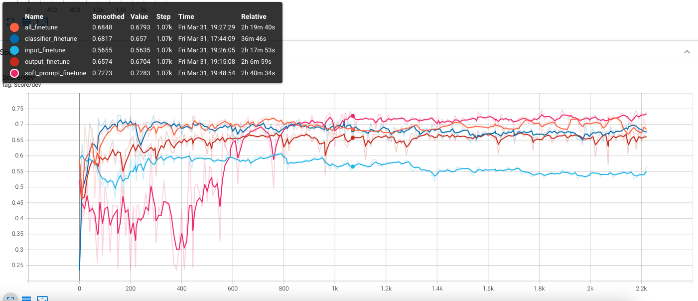
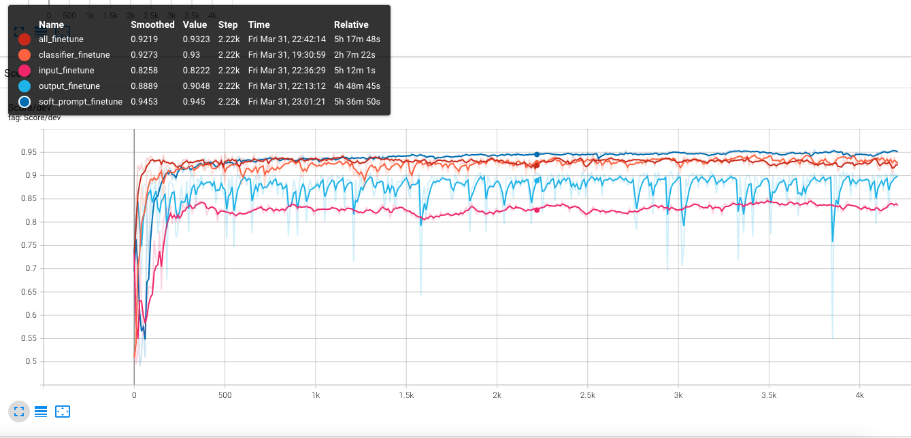

# Experiment Description

<p> As a finetuning experiment, we are going to experiment with the following baselines including soft-prompt tuning. </p>
<ul>

  <li><b>All-finetuning</b>: We update every parameter in the encoder-decoder T5 on the downstream task. For this baseline a very small learning rate such as 0.0005 is effective.
  </li></br>

  <li><b>output-finetuning</b>: We update only the language modelling head on top of the T5 decoder on the downstream task. For this baseline a learning rate such as 0.001 is effective.
  </li></br>

  <li><b>input-finetuning</b>: We update only the input embedding table for the T5 encoder on the downstream task. For this baseline a learning rate such as 0.001 is effective.
  </li></br>

  <li><b>classifier-finetuning</b>: We train an auxiliary feedforward classifier which is built on the top of the T5 encoder on the downstream task. For this baseline a learning rate such as 0.001 is effective.
  </li></br>

  <li><b>soft-prompt tuning</b>: We train only an auxiliary prompt table included in the encoder-decoder T5 model on the downstream task. For soft-prompt tuning, a large learning rate around 0.3 is effective. In the experiments, we use 50 or 100 prompt tokens, depending on the task. Therefore our prompt length is either 50 or 100 in the script inputs.
  </li></br>
</ul>


<b>We are training these baselines on the semeval-2018 sentiment dataset or the SST2 sentiment dataset for up to 30 epochs. We use Vector's GPU cluster and the slurm scheduler to submit five GPU jobs to train these models with the various configurations described above. For this experiment, we don't need to login to a specific GPU node and we can submit the jobs from the login nodes on the Vector Vaughan cluster.</b>

# Virtual Environment Setup

1. If you want to use our pre-built environment to run experiments, simply run
    ```bash
    source /ssd003/projects/aieng/public/prompt_zoo/bin/activate
    ```

    If you are using the pre-built environments you do not have permissions to modify it. That is, you cannot pip install any new dependencies.

2. The first option is recommended. However, you can build your own venv that you are free to modify by running the commands below. We install our prompt module in the development mode so if we change code, the env gets updated with our changes.

    ```bash
    bash setup.sh OS=vcluster ENV_NAME=prompt_torch DEV=true
    ```
    then activate the environment
    ```bash
    source ./prompt_torch-env/bin/activate
    ```

    __Note__: If the env already exists in your repository you need not run the setup again. Just source it as instructed. The above will take a few moments to complete

# Submitting the Training Jobs on SemEval Dataset

We need to create the following directories to save the model checkpoints on the vector's cluster.

These directories will hold the training and evaluation results for each of the experiments. They can be viewed with tensorboard following the comments below. If you do not have access to a scratch directory, please let your facilitator know!

```bash
export USER_DIR="/scratch/ssd004/scratch/$USER"
mkdir -p ${USER_DIR}/semeval
mkdir -p ${USER_DIR}/semeval/all_finetune
mkdir -p ${USER_DIR}/semeval/input_finetune
mkdir -p ${USER_DIR}/semeval/output_finetune
mkdir -p ${USER_DIR}/semeval/classifier_finetune
mkdir -p ${USER_DIR}/semeval/soft_prompt_finetune
```

## Fine Tuning all weights of T5

Submitting the job for `all_finetuning` baseline with the learning rate 0.0005:
```bash
sbatch src/reference_implementations/run_singlenode_prompt.slrm \
    src/reference_implementations/prompt_zoo/training_scripts/finetuning_sentiment.sh \
    ./torch-prompt-tuning-exps-logs \
    all_finetune \
    semeval \
    ${USER_DIR}/semeval/all_finetune \
    0.0005
```

## Fine tuning only the input layer of T5

Submitting the job for `input_finetuning` baseline with the learning rate 0.3:
```bash
sbatch src/reference_implementations/run_singlenode_prompt.slrm \
    src/reference_implementations/prompt_zoo/training_scripts/finetuning_sentiment.sh \
    ./torch-prompt-tuning-exps-logs \
    input_finetune \
    semeval \
    ${USER_DIR}/semeval/input_finetune \
    0.3
```

## Fine tuning only the output layer of T5

Submitting the job for `output_finetuning` baseline with the learning rate 0.005:
```bash
sbatch src/reference_implementations/run_singlenode_prompt.slrm \
    src/reference_implementations/prompt_zoo/training_scripts/finetuning_sentiment.sh \
    ./torch-prompt-tuning-exps-logs \
    output_finetune \
    semeval \
    ${USER_DIR}/semeval/output_finetune \
    0.005
```

## Fine tuning only a classifier on the output activations of T5

Submitting the job for `classifier finetuning` baseline with the learning rate 0.01:
```bash
sbatch src/reference_implementations/run_singlenode_prompt.slrm \
    src/reference_implementations/prompt_zoo/training_scripts/finetuning_sentiment.sh \
    ./torch-prompt-tuning-exps-logs \
    classifier_finetune \
    semeval \
    ${USER_DIR}/semeval/classifier_finetune \
    0.01
```

## Soft Prompt Tuning 100 continuous prompt tokens for T5

Submitting the job for `soft_prompt_tuning` with the learning rate 0.3:
```bash
sbatch src/reference_implementations/run_singlenode_prompt.slrm \
    src/reference_implementations/prompt_zoo/training_scripts/soft_prompt_sentiment.sh \
    ./torch-prompt-tuning-exps-logs \
    soft_prompt_finetune \
    semeval \
    ${USER_DIR}/semeval/soft_prompt_finetune \
    0.3 \
    100
```

To view the tensorboard with the training status for all of the submitted jobs:

```bash
tensorboard --logdir=${USER_DIR}/semeval/ --bind_all
```

__NOTE__: You will need to create a tunnel directory to the v instance that you are starting the tensorboard on. This will be one of `v1`, `v2`, or `v3`. It is written in your prompt as `username@v#`... so replace `v` in the command below with the `v#` that you have on your command line

The tensorboard command will finish and stall in the terminal you're working with. Now, in another terminal window, create an ssh tunnel to the port bound by the tensorboard command. We used in the command below from out local computer, where the bound port was, for example, `6006`:

```bash
ssh username@v.vectorinstitute.ai -L 6006:localhost:6006
```

Then visit `https://localhost:6006`.

__NOTE__: If you get an issue where the port is already in use you can specify the point that tensorboard should use with `--port=xxxx`. Then change all instances of `6006` above to the newly specified port

## TensorBoard Results



# Submitting the Training Jobs on SST2 Dataset

We need to create the following directories to save the model checkpoints on the vector's cluster.


```bash
export USER_DIR="/scratch/ssd004/scratch/$USER"
mkdir -p ${USER_DIR}/sst2
mkdir -p ${USER_DIR}/sst2/all_finetune
mkdir -p ${USER_DIR}/sst2/input_finetune
mkdir -p ${USER_DIR}/sst2/output_finetune
mkdir -p ${USER_DIR}/sst2/classifier_finetune
mkdir -p ${USER_DIR}/sst2/soft_prompt_finetune
```

## Fine Tuning all weights of T5

Submitting the job for `all_finetuning` baseline with the learning rate 0.0005:
```bash
sbatch src/reference_implementations/run_singlenode_prompt.slrm \
    src/reference_implementations/prompt_zoo/training_scripts/finetuning_sentiment.sh \
    ./torch-prompt-tuning-exps-logs \
    all_finetune \
    sst2 \
    ${USER_DIR}/sst2/all_finetune \
    0.0005
```

## Fine tuning only the input layer of T5

Submitting the job for `input_finetuning` baseline with the learning rate 0.3:
```bash
sbatch src/reference_implementations/run_singlenode_prompt.slrm \
    src/reference_implementations/prompt_zoo/training_scripts/finetuning_sentiment.sh \
    ./torch-prompt-tuning-exps-logs \
    input_finetune \
    sst2 \
    ${USER_DIR}/sst2/input_finetune \
    0.3
```

## Fine tuning only the output layer of T5

Submitting the job for `output_finetuning` baseline with the learning rate 0.01:
```bash
sbatch src/reference_implementations/run_singlenode_prompt.slrm \
    src/reference_implementations/prompt_zoo/training_scripts/finetuning_sentiment.sh \
    ./torch-prompt-tuning-exps-logs \
    output_finetune \
    sst2 \
    ${USER_DIR}/sst2/output_finetune \
    0.01
```

## Fine tuning only a classifier on the output activations of T5

Submitting the job for `classifier finetuning` baseline with the learning rate 0.01:
```bash
sbatch src/reference_implementations/run_singlenode_prompt.slrm \
    src/reference_implementations/prompt_zoo/training_scripts/finetuning_sentiment.sh \
    ./torch-prompt-tuning-exps-logs \
    classifier_finetune \
    sst2 \
    ${USER_DIR}/sst2/classifier_finetune \
    0.01
```

## Soft Prompt Tuning 50 continuous prompt tokens for T5

Submitting the job for `soft_prompt_tuning` with the learning rate 0.5:
```bash
sbatch src/reference_implementations/run_singlenode_prompt.slrm \
    src/reference_implementations/prompt_zoo/training_scripts/soft_prompt_sentiment.sh \
    ./torch-prompt-tuning-exps-logs \
    soft_prompt_finetune \
    sst2 \
    ${USER_DIR}/sst2/soft_prompt_finetune \
    0.5 \
    50
```

To view the tensorboard with the training status for all of the submitted jobs:

```bash
tensorboard --logdir=${USER_DIR}/sst2/ --bind_all
```

__NOTE__: You will need to create a tunnel directory to the v instance that you are starting the tensorboard on. This will be one of `v1`, `v2`, or `v3`. It is written in your prompt as `username@v#`... so replace `v` in the command below with the `v#` that you have on your command line

The tensorboard command will finish and stall in the terminal you're working with. Now, in another terminal window, create an ssh tunnel to the port bound by the tensorboard command. We used in the command below from out local computer, where the bound port was, for example, `6006`:

```bash
ssh username@v.vectorinstitute.ai -L 6006:localhost:6006
```

Then visit `https://localhost:6006`.

__NOTE__: If you get an issue where the port is already in use you can specify the point that tensorboard should use with `--port=xxxx`. Then change all instances of `6006` above to the newly specified port

# Running hyper-parameter search and training of fine-tuning baselines on `SST2`:

This will kick off a learning rate hyper-parameter sweep for both the various fine-tuning strategies and the soft prompt tuning algorithm.


```bash
source /ssd003/projects/aieng/public/prompt_zoo/bin/activate
```
then
```bash
bash ./src/reference_implementations/prompt_zoo/training_scripts/run_sst2_sentiment_experiments.sh
```

__Note__: This script can also be used to run a hyper-parameter search for the semeval dataset by changing any mention of sst2 in the `run_sst2_sentiment_experiments.sh` to semeval.

## TensorBoard Results


